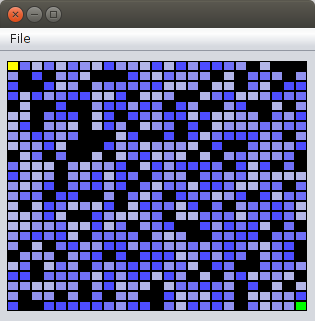
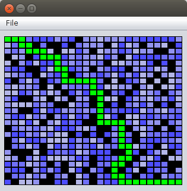

#Kayttoohje

Ohjelmaa voidaan käynnistää komennolla ```java -jar Tiralabra_maven-1.0-SNAPSHOT.jar``` tai tupla klikkaamalla jar-tiedostoa. Ohjelmassa komennot: ovat open, new maze, findPath ja exit.


Kuva sovelluksen komennoista

 - ```open``` avaa sokkeloa sisältävän tiedoston.
 - ```save``` tallentaa sokkelon tiedostoon.
 - ```new``` maze piirtää satunnaisesti generoidun sokkelon.
 - ```findPath``` piirtää lähtöruudusta maaliruutuun vievän reitin, jos sellaista löytyy.
 - ```exit``` sulkee sovelluksen.


Ohjelman hyväksymä tekstitiedosto on muotoa:

```
S # # # # # # # # #
1 2 3 4 5 6 7 8 9 #
# # # 4 5 6 # # # #
1 9 7 6 8 6 # 8 # #
5 2 3 4 5 # 7 8 # #
1 7 3 8 3 6 5 8 4 #
8 2 3 4 # # # # 5 G

```

```S``` merkitsee lähtöruutua, ```#``` estettä ja ```G``` maaliruutua.
Ruudut on eroteltu toisistaan välilyönnein. Ruutuun on kirjoitettu sen paino.


Kuva satunnaisesta sokkelosta.



Kuva satunnaisesta sokkelosta ratkaistuna.

