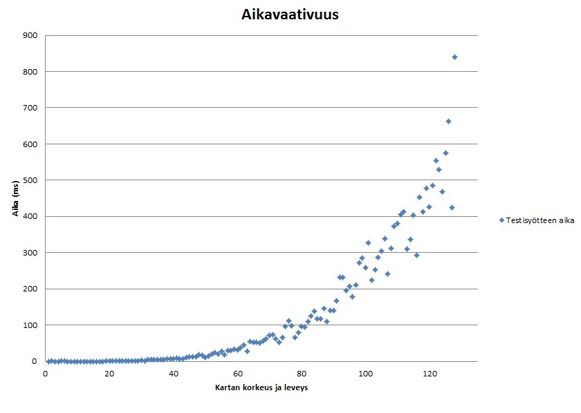
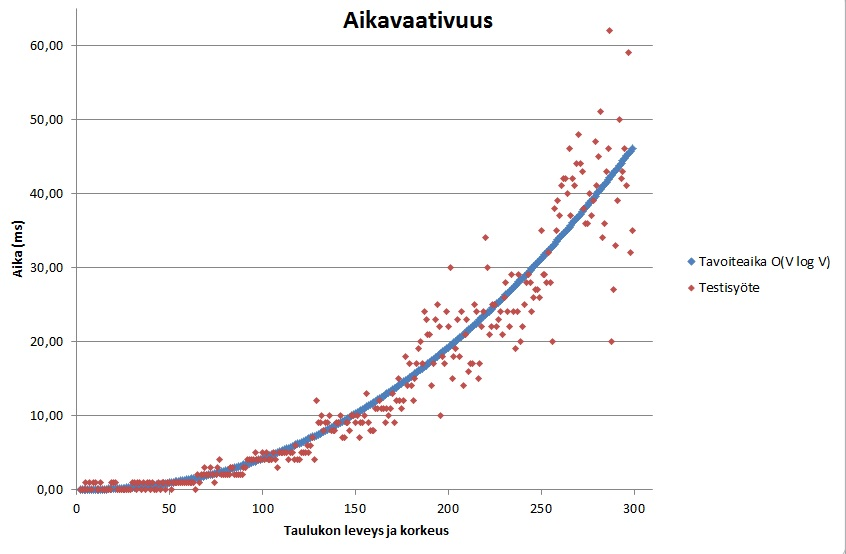
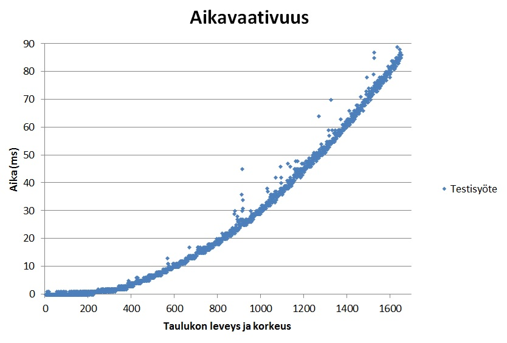
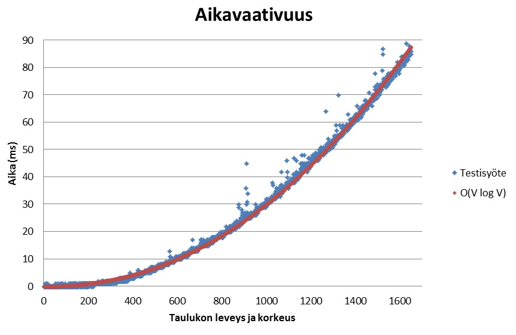

Testausdokumentti
==================
Paketit ja testiluokat
-----------------------
Labyrintti
- KaynnistysTest

Labyrintti/osat
- PohjaTest
- RuutuTest

Labyrintti/sovellus
- EtsijäTest
- MinimikekoTest

Paketissa labyrintti/gui olevia graafisen käyttöliittymän luokkia ei testata ollenkaan, samoin ei testata App-luokkaa, joka on ohjelman Main. Käynnistys-luokan testaus on vähäinen, käyttäjälle on kattavat käyttöohjeet, joissa kerrotaan mm. milloin ohjelma kaatuu.

Testit on kirjoitettu JUnit-testeinä. Testien rivikattavuutta on valvottu coberturalla.
Testit voidaan toistaa ajamalla testiluokat.

Suorituskykytestaus
--------------------
A* testattiin n x n taulukolla (n välillä 2-129), jossa kaikki arvot olivat 1, lähtö vasemmassa yläkulmassa ja maali oikeassa alakulmassa, esim 3 x 3 taulukko:

	L 1 1
	1 1 1
	1 1 M

Minimikeon rakentaminen testattiin n x n taulukolla (n välillä 1-1650), jossa keon arvot ennen järjestämistä olivat n-1, n-2, ..., 2, 1, 0. Keon rakentamisessa käytetään heapify-metodia.

Esim 3 x 3 taulukko ennen järjestämistä 8, 7, 6, 5, 4, 3, 2, 1, 0.

