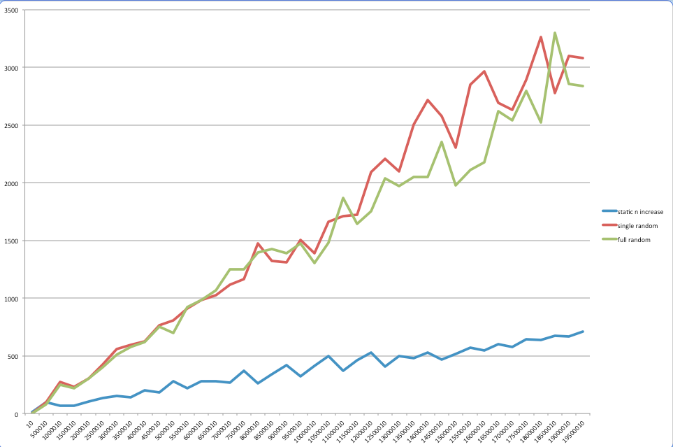

# Testausdokumentti

Testasin aikavaativuutta kolmella eri metodilla n=20M asti.

Testisyötteet olivat:

1. Sama merkki toistettuna n kertaa (static n increase)
2. Loin aluksi max-merkkisen satunnaissyötteen, josta otin n ensimmäistä merkkiä (single random
3. Jokaisella diskreetillä n arvolla loin uuden n-merkkisen satunnaissyötteen (full random)


## Miten testit voidaan toistaa

Ajamalla ```fi.jw.cs.tiralabra.cli.PerformanceTester```

## Ohjelman toiminnan empiirisen testauksen tulosten esittäminen graafisessa muodossa.



