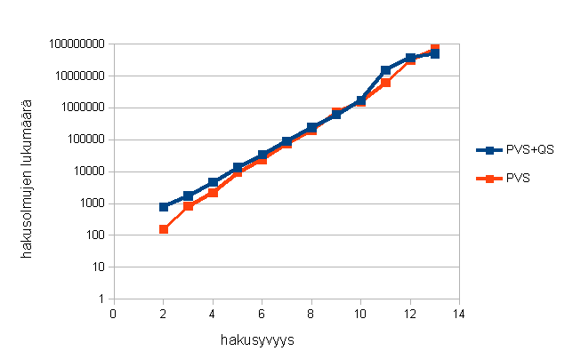
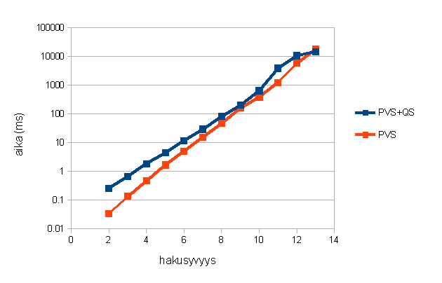

Testausdokumentti
=================

Ohjelman oikeellisuutta on testattu melko kattavasti JUnit-testien avulla, ja testikattavuuden parantamisessa on apuna käytetty coberturaa. Ainoastaan käyttöliittymää ja suorituskykytestejä varten ei ole JUnit-testejä.

Lisäksi tekoälyä on peluutettu itseään ja aikaisempia versioita vastaan satunnaisesti generoiduissa pelitilanteissa. Asettamalla siirtojen aikaraja riittävän pieneksi pystytään pelaamaan satoja pelejä, ja voittoprosentin avulla saadaan karkea kuva tekoälyn tason kehityksestä. Nämä testit eivät kuitenkaan ole helposti toistettavissa vaan vaativat lähdekoodiin puukottamista.

Suorituskykyä on testattu jatkuvasti kehityksen aikana käyttäen samaa suorituskykytestiä.

Testi generoi pelitilanteita, joissa nappuloiden sijainti ja lukumäärä laudalla on täysin satunnainen (ei kuitenkaan matti-/pattitilanteita eikä sotilaita ensimmäisellä tai viimeisellä rivillä). Jokaiseen pelitilanteeseen etsitään paras siirto ilman aikarajaa, mutta rajoittamalla haku tiettyyn syvyyteen. Suorituskerroista mitataan keskimääräinen aika, ja keskimääräinen vierailtujen solmujen lukumäärä iteratiivisesti syvenevän haun viimeisellä iteraatiolla. Jokaisella syvyydellä analysoidaan niin monta pelitilannetta kuin 60 sekuntin aikana ehtii.

Nopeustestin tulokset on esitetty seuraavissa graafeissa. Testi on toistettu sekä ilman Quiescence-hakua (pelkkä PVS), että sen kanssa (PVS+QS). Jälkimmäinen kasvattaa hakusolmujen määrää huomattavasti varsinkin pienillä syvyyksillä.

Syvyyksillä d > 10 otanta on niin pieni, että arvot eivät ole kovin luotettavia.

Tuloksista kuitenkin näkee hyvin aikavaativuuden eksponentiaalisuuden (O(b^d)). Solmujen lukumäärästä saadaan haun efektiiviseksi haarautumiskertoimeksi n. d=3,3.

