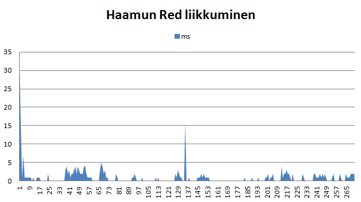
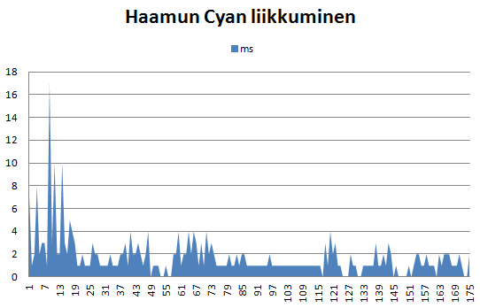
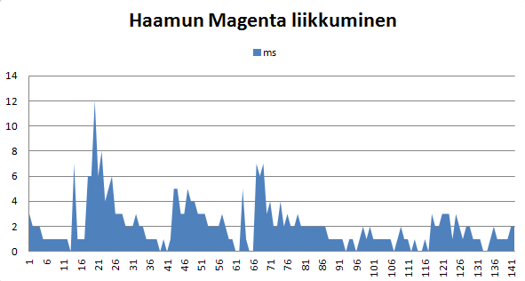
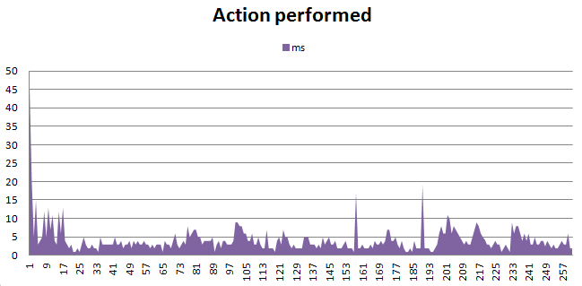

<h1> Testausdokumentti Pacman </h1>

Ohjelmaa on testattu käyttäen JUnitia. Jokaisen luokan koodia on testattu erikseen, mahdollisimman kattavasti, omassa testiluokassaan. Pyrkimyksenä on ollut testata jokaista yksittäistä metodia. Kokoavien metodien testaus ei ole ollut kovin laajaa, koska pienten metodien testaus kattaa myös näiden kokoavien metodien testaamisen. Privatemetodeja ei ole testattu.

Pelin toimintaa on myös testattu pelaamalla peliä paljon, useampi koekäyttäjä on testannut pelin toimintaa.

Testit voidaan suorittaa normaalisti, kuten tavallinen ohjelmakoodi, valitsee vain oikean testitiedoston ajettavaksi. Testit sijaitsevat tiedostopolun /Tiralabra/test/Pacman/ takaa. Hakemistossa Pacman on hakemistot pakkausten mukaan ja näiden alta löytyy luokkakohtaiset testit.

<h2> Koodin empiirinen testaus </h2>

<h3>Suorituskykytestaus</h3>
Suorituskykytestauksessa on tarkasteltu kuinka kauan tärkeimpien osa-alueiden, kuten hakualgoritmin, järjestämisen ja pelin kokonaisvaltainen suorittaminen, kuluttaa aikaa.

<h3>Haamut</h3>
Ensimmäiseksi tarkasteltavana on hakualgoritmin toiminta eri haamujen liikuttamisessa. Haamuista Red, Magenta ja Cyan käyttävät liikkumiseensa hakualgoritmia.

<h4>Red</h4>

Ensimmäinen kaavio kuvaa, kuinka paljon haamua Red liikuttava metodi, joka käyttää hakualgoritmia AStar, kuluttaa aikaa satunnaisella pelin pelaamiskerralla. Red liikkuu siten, että se jahtaa Mania kohteenaan Man itse.

Kaaviosta pystyy havaitsemaan selkeää heittelyä, jotka käyvät ilmi pelin kulun lähemmässä tarkastelussa. Alussa oleva korkea piikki selittyy sillä, että tässä vaiheessa punaisen haamun etäisyys Manista on todennäköisesti suurimmillaan. 

Suurempi selkeä heilahdus metodin suorituskerralla 38 selittyy sillä, että haamu heikennetään. Haamun maaliruutu, joka on tähän asti ollut Man itse, muuttuu. Heikennetyn punaisen haamun maali on ruutu, joka on pelialustan vastakkaisella puolella peilattuna pystyakselin suhteen. Aikaa kuluu enemmän siten siksi, että uusi ruutu sijaitsee kauempana. Kun haamut ovat heikennettyjä, Man liikkuu nopeammin, joten se saa otettua paremmin etäisyyttä haamuihin.  Jo kohdassa 43 Red muuttuu takaisin vahvaksi, koska Man syö tämän. Haamu palaa alkuun, joten matka taas kohteeseen, eli Maniin, on sen verran pidempi, että aikaa kuluu liikuttamiseen. Tällainen noin 4ms kuluttava heilahtelu johtuu siitä, että haamu vaihtelee vahvasta heikoksi ja heikosta vahvaksi.

Suuri heilahdus kohdassa 127 johtuu siitä, että tässä vaiheessa haamu oli heikkona ja Man liikkui nopeasti kauas haamusta, joten seuraavan liikahduksen selvittämiseen meni huomattavasti aikaan.
Pääosin kuitenkin haamun liikuttamismetodi toimii nopeudella 0ms tai 1ms. Tämä johtuu siitä, että pääosan pelistä haamu kulkee vain muutaman ruudun Manin perässä, joten lyhin reitti haamun ruudusta Manin ruutuun ei kuluta juurikaan aikaa.

<h4>Cyan</h4>

Cyan liikkuu siten, että sen kohteena on joko muutama ruutu Manin edellä oleva ruutu tai, jos tämä ruutu ei ole mahdollinen kohteena on Man itse.

Cyanin liikettä kuvaavasta kaaviosta voi huomata sen, että alussa aikaa haamun liikuttamiseen kuluu enemmän. Tämä johtunee siitä, että haamu ei ole saanut Mania tässä vaiheessa vielä kiinni, joten on mahdollista, että Man voi niin sanotusti huijata haamua, siten että haamu säntäilee ympäriinsä yrittäen ennakoida Manin liikkeitä.

Myöhemmin, kun haamu on saanut Manin kiinni, on liike samantyyppistä Redin liikkeen kanssa. Tämä johtuu siitä, että Cyan samalla lailla ollessaan heikko, muuttaa suuntaansa kuten Red; alkuperäisen kohteensa peilikuvaksi vastakkaiselle puolelle alustaa. Jos haamun ollessa heikkona, haamu on siinä ruudussa, jonka kuuluisi olla sen kohde, kohde on tällöin Manin ruutu. 

Erona kuitenkin Redin liikkumisen kaavioon on se, että yleisemmin aikaa kuluu noin 1ms, kun taas Red oli niin nopea, että yleensä kului aikaa vain 0ms. Tämä ero johtuu todennäköisesti siitä, että kohderuutu on Cyanilla aina hieman kauempani kuin Redillä haamujen kulkiessa Manin perässä. 

<h4>Magenta</h4>

Magenta liikkuu siten, että se arpoo alussa itselleen kohteen, johon se pyrkii. Kun haamu saavuttaa maalinsa, se arpoo itselleen uudelleen maalin. Tällä tavoin haamu jatkaa koko pelin ajan, Magenta ei liiku erilailla ollessaan heikko.

Kaaviosta näkee selkeästi, että kun haamu arpoo itselleen uuden maalin ja liikahtaa ensimmäisen kerran aikaa kuluu eniten reitin selvittämiseen. Tämän jälkeen aika vähenee tasaisesti mitä lähemmäksi haamu pääsee kohdettaan. Aika on noin 0ms tai 1ms aivan maalin vieressä tai kun haamu saavuttaa maalin. Jos uusi maali, jonka haamu arpoo itselleen, on lähellä, ei ajassa näy niin suurta piikkiä.

<h4>Yleiset huomiot</h4>
Kaaviosta pystyy selkeästi havaitsemaan (varsinkin Magentan kaaviosta), että hakualgoritmi menee O(n^2*log n) mukaisesti, kun etäisyys maalin ja lähdön välillä kasvaa.

<h3>Peli</h3>
Mielenkiinnosta tutkin myös pelin kokonaisvaltaiseen suoritukseen kuluvaa aikaa. ActionPerformed on metodi, joka pyörittää pelin toiminta logiikkaa.

Alussa kuluu eniten aikaa, koska haamuille selvitettävät matkat ovat tässä vaiheessa ainakin Redillä ja Cyanilla pisimmät. Huomattavat piikit pelin suorituksessa ovat kohdat, joissa esimerkiksi, joillekin haamuille selvitetään uusia pidempiä reittejä, hedelmä arvotaan pelialustalle tai, kun haamut asetetaan heikoiksi.
