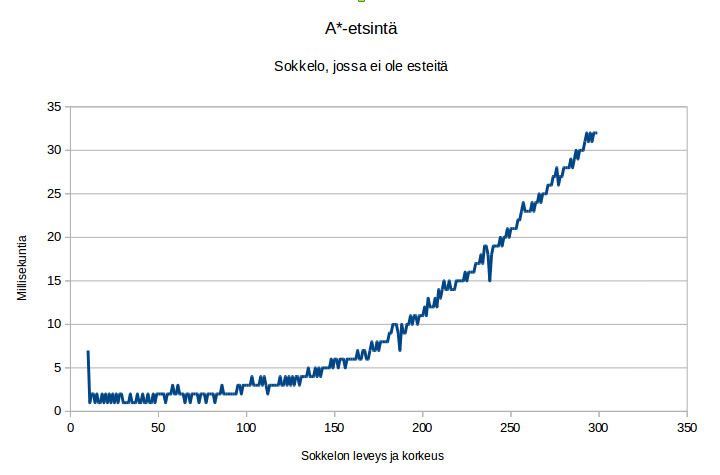
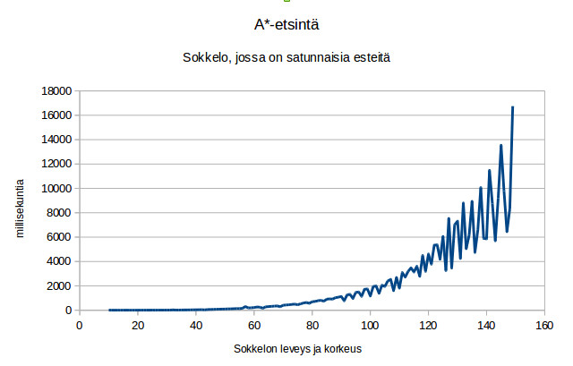

Testausdokumentti
=================

Testaukseen on käytetty JUnitia.

##Testatut paketit ja luokat

  - ```datastructures``` sisältää sovelluksen tietorakenteet
    - PriorityQueue	on tietorakenne, jota A* käyttää.
    - AbstractHeap ja sen aliluokat MaxHeap	ja MinHeap ovat kekoja ja Valuable on keon sisältämien olioden rajapinta.
    - List on linkitetty lista.
    - ListIterator on listan iteraattori.
    - Set on juokko.


  -  ```algorithm``` sisältää sovelluksen ydin-algoritmin A* ja
        siihen liittyvät tietorakenteet
    - Graph on verkon rajapinta.
    - Heuristic	on heurestiikka funktiota toteuttavan luokan rajapinta.
    - Search on etsintää toteuttavan luokan rajapinta.
    - State	on solmun tietoja sisältävän luokan rajapinta.
    - AStarSearch on A*-algoritmia toteuttavan luokan rajapinta.
    - Node on verkon solmu


  -  ```maze``` sisältää sokkelon.
    - Maze on sokkeloa toteuttavan luokan rajapinta.
    - AbstractMaze on sokkeloiden yliluokka.
    - SimpleMaze on sokkelo, jossa ei ole esteitä ja jonka painot ovat yksi.
    - ArrayMaze on taulukkona toteutttu sokkelo, jossa voi olla esteitä. Sen ruutuihin on mahdollista määritellä painot.
    - MazeNode on sokkelon ruutu.


  -  ```io``` sisältää sokkeloita lukevat ja kirjoittavat luokat.
    - Parser AsciiParser:in ja AsciiWithTabsParser:in yliluokka.
    - AsciiParser parseraa ascii merkkijonon taulukoksi.
    - AsciiWithTabsParser parseraa merkkijonon taulukoksi.
    - FileParser parseraa ascii tiedoston taulukoksi.
    - MazePrinter tulostaa sokkelon.

```gui``` pakettia ei ole testattu lainkaan eikä ```App```-luokkaa.


##Empiirisen testauksen tulosten

Testauksessa luotiin ArrayMaze-olio, jonka taulukon arvot ovat satunnaisesti generoituja.
Näissä sokkelossa ei ole esteitä.



Testauksessa luotiin ArrayMaze-olio, jonka taulukon arvot ovat satunnaisesti generoituja.
Näissä sokkelossa on satunnaisesti generoituja esteitä.



JUnit testit voidaan toistaa suorittamalla testiluokat.
Empiirisen testauksen voi suorittaa käyttämällä Stats-luokka.
