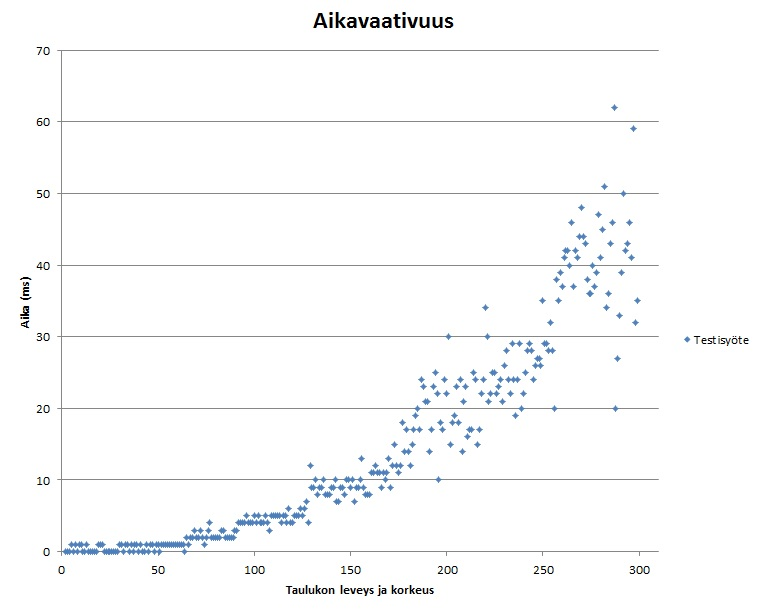

Testausdokumentti
==================
Paketit ja testiluokat
-----------------------
Labyrintti/osat
- PohjaTest
- RuutuTest

Labyrintti/sovellus
- EtsijäTest
- MinimikekoTest

Paketissa labyrintti/gui olevia graafisen käyttöliittymän luokkia ei testata ollenkaan, samoin ei testata App-luokkaa, joka on ohjelman Main. Toistaiseksi puuttuu Käynnistyksen testaus.

Testit on kirjoitettu JUnit-testeinä. Testien rivikattavuutta on valvottu coberturalla.
Testit voidaan toistaa ajamalla testiluokat.

Suorituskykytestaus
--------------------
A* testattiin n x n taulukolla (n välillä 2-129), jossa kaikki arvot olivat 1, lähtö vasemmassa yläkulmassa ja maali oikeassa alakulmassa, esim 3 x 3 taulukko:

	L 1 1
	1 1 1
	1 1 M

