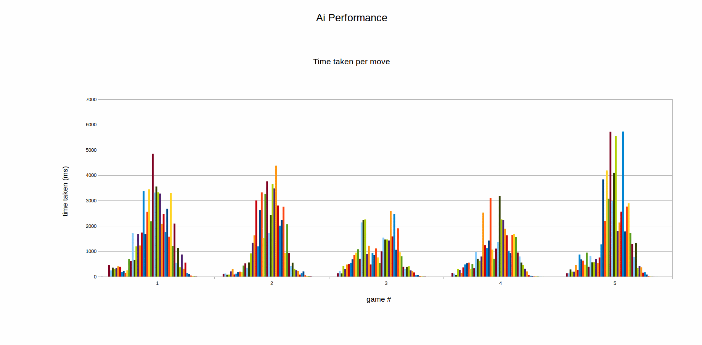

AI
===
* Testattu vain, että tekoäly ei aiheuta virheitä ohjelmassa esim, jättämällä tekemiään siirtoja pöydälle. Tämä siksi, että objektiivisesti parhaan siirron testaaminen on hankalaa. Siirtojen alfa- ja beta -arvojen laskeminen on kuitenkin testattu debuggauksella, eikä siinä pitäisi olla suurempia virheitä.
* Lisäksi tehokkuustestit AIPerformance -luokassa. Tulos viiden pelin testauksesta:
  
* Musta ja valkoinen pelaaja voittavat suurinpiirtein yhtä paljon ensimmäisten kahden vuoron ollessa satunnaisia, joten tässäkään ei pitäisi olla ongelmia.

Board
=====
* Testattu, että nappuloiden asettaminen ja kääntäminen toimii moitteetta.
* Testattu, että siirtojen peruminen toimii moitteetta.
* Testattu, että BigInteger-avain laudalle lasketaan oikein.

Tietorakenteet
==============
* Testattu perustoimintojen virheettömyys kattavasti.
* Testattu ArrayListin operaatioiden ja järjestämisen tehokkuus (tulos: hyvin tehokas).
* ZobristHashista testattu, että sama pelilauta saa aina saman BigInteger -avaimen.

MoveTransmitter ja TextUI -luokat
=================================
* Ei testattu, mutta toistuva ajaminen osoittavat toimiviksi. Luokkien tehtävä on yksinkertainen eikä niitä ole tarkoitusta missään vaiheessa laajentaa, vaan pikemminkin ehkä korvata kunnollisella käyttöliittymällä, joten testejä ei tarvittu.
