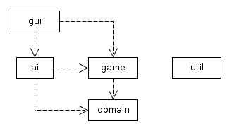
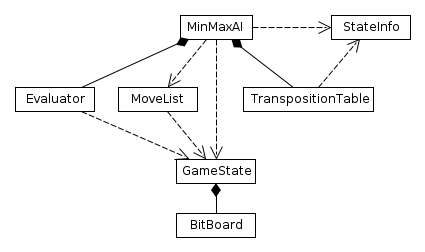

Toteutusdokumentti
==================

Yleisrakenne
------------

Työssä on toteutettu shakkitekoäly, ja sitä käyttävä graafisella käyttöliittymällä varustettu shakkiohjelma. Ydintoiminnallisuus on jaettu Java-projektissa neljään pakettiin:

**Domain**-paketissa on toteutettu abstraktio pelitilanteelle, shakin säännöt, tehokas siirtojen generointi, bittimaskien manipulointi yms. operaatiot. Tarkoitus on ollut rakentaa pohja, jonka päälle voisi mahdollisesti rakentaa useita eri shakkitekoälyjä.

**Game**-paketissa on toteutettu MVC-tyylinen lähestymistapa yksittäiselle pelille. Pelille annetaan kaksi pelaajaobjektia, jotka voivat olla joko käyttöliittymässä toteutettuja ihmispelaajia tai tietokonepelaajia. Observer-rajapinnan kautta annetaan tietoa pelin kulusta.

**AI**-paketissa on toteutettu varsinainen MinMax-tekoäly ja sen tarvitsemat komponentit.

**GUI**-paketissa on toteutettu ohjelman käyttöliittymä.

Toteutetut shakin säännöt
-------------------------
Peli ja tekoäly tukevat lähes kaikkia shakin sääntöjä ja nappuloiden siirtoja, mukaan lukien pattitilanteet, tornitukset, korotukset, ohestalyönnit ja 50 siirron sääntö. Ainoa puutteellisesti toteutettu sääntö on pattitilanne silloin, kun sama pelitilanne toistuu kolme kertaa. Nyt peli päättyy tasapeliin jo ensimmäisellä toistumisella.

Tekoälyn toteutus
-----------------

Kaavio keskeisten luokkien välisistä suhteista:

* **Minmax/negamax (chess.ai.MinMaxAI)** - Hakualgoritmin runkona on negamax-haku. Pelipuu käydään läpi rekursiivisesti tiettyyn syvyyteen asti, ja kumpikin pelaaja maksimoi omaa pistemääräänsä.

* **Iteratiivisesti syvenevä haku** - Hakua suoritetaan jatkuvasti uudelleen kasvattaen syvyyttä yhdellä, kunnes annettu aikaraja tai maksimisyvyys tulee vastaan. Haku palauttaa viimeisen kokonaan suoritetun iteraation löytämän siirron.

* **[Alfa-beeta-karsinta](http://en.wikipedia.org/wiki/Alpha%E2%80%93beta_pruning)** - Jokaisessa hakupuun solmussa pidetään yllä kahta muuttujaa. Alfa vastaa pelaajan omaa parasta siirtoa, ja beeta aikaisemmin löydettyä vastustajan parasta siirtoa. Jos jonkin siirron pistemäärä on vähintään beeta, voidaan kyseisen alipuun etsiminen lopettaa.

* **PVS (Principal variation search) ja nollaikkunahaku** - Ainoastaan ensimmäinen siirto (principal variation) etsitään käyttäen täyttä alfa-beeta-väliä. Tämän jälkeen riittää todistaa, että muut siirrot ovat huonompia, ja niille hakuikkunan kooksi asetetaan pienin mahdollinen (alfa = beta - 1). Jos tämä epäonnistuu, niin haku tehdään uudestaan täydellä ikkunan koolla.

* **Quiescence-haku** - Normaali minimax antaa haun viimeiselle tasolle kohtuuttoman ison merkityksen ([horizon effect](http://en.wikipedia.org/wiki/Horizon_effect)). Tätä vaikutusta minimoidaan jatkamalla hakua, kunnes löydetään tilanne, jossa kannattavia lyöntejä ei ole enää tehtävissä.

* **Pelitilanteiden pisteytys (chess.ai.Evaluator)** - Pelitilanteille annetaan pistemäärä pelaajien nappuloiden yhteisarvojen (sotilas 100, ratsu 300 jne.) erotuksena. Tätä on vielä hienosäädetty niin, että kunkin nappulan arvo riippuu sijainnista laudalla, jolla on pyritty parantamaan etenkin alku- ja loppupeliä.

* **Siirtojen järjestäminen (chess.ai.MoveList)** - Siirtojen generoinnin yhteydessä ne järjestetään siten, että lyönnit etsitään ennen muita siirtoja, ja myös lyönnit laitetaan paremmuusjärjestykseen (PxQ ennen QxP).

* **Transpositiotaulu (chess.ai.TranspositionTable)** - Haun läpikäymät pelitilanteet tallennetaan hajautustauluun, jossa avaimena käytetään pelitilanteesta muodostettua [Zobrist-tunnistetta](http://chessprogramming.wikispaces.com/Zobrist+Hashing). Transpositiotauluun tallennetaan tilanteen pistemäärä, ja onko se tarkka arvo, alaraja tai yläraja, mikä riippuu alfa-beta-karsinnan käyttäytymisestä kyseisessä hakupuun solmussa. Jokaisessa hakupuun solmussa tarkistetaan, löytyykö tilanne transpositiotaulusta, ja onko se analysoitu vaadittuun syvyyteen asti. Jos mahdollista, niin palautetaan tallennettu pistemäärä. Lisäksi transpositiotauluun tallennetaan paras löydetty siirto, jota haku kokeilee ensimmäisenä, jos tallennetun pistemäärän käyttäminen ei ollut mahdollista.

* **Soft fail** - Hakufunktion palauttama paras pistemäärä voi olla pienempi kuin alfa tai suurempi kuin beeta. Tämä mahdollistaa tiukempien rajojen tallentamisen transpositiotauluun.

* **Inkrementaaliset päivitykset (makeMove()/undoMove())** - Pelitilanteen, pistemäärän ja Zobrist-tunnisteen päivitys tapahtuu inkrementaalisesti jokaisessa hakupuun haarassa. Näin vältytään pelitilan kopioinnilta ym. kalliilta operaatioilta.

* **Laudan ja sijaintien esitys bittimaskien avulla (chess.domain.BitBoard)** - Nappuloiden sijaintien ja siirtojen esittämiseen on käytetty 64-bittisiä bittimaskeja, siten että yksi bitti vastaa yhtä ruutua (bitti 0 on vasen yläkulma, 63 oikea alakulma).

* **Siirtojen generointi bittimaskien avulla (chess.domain.MoveMasks)** - Jokaista nappulatyyppiä ja sijaintia kohden luodaan etukäteen bittimaski, joka sisältää kaikki sallitut siirrot.

* **[Magic bitboards](http://chessprogramming.wikispaces.com/Magic+Bitboards)** - Lähetin, tornin, kuningattaren siirrot riippuvat sijainnin lisäksi muista nappuloista. Muiden nappuloista muodostetaan bittimaski, joka kuvataan täydellistä minimaalista funktiota käyttäen välille 0..4095. Jokaista sijaintia ja muiden nappuloiden kombinaatiota kohden generoidaan oma siirtomaski.

Aika- ja tilavaativuudet
------------------------
Yleisen haun keskimääräiseksi aikavaativuudeksi syvyyden suhteen saatiin satunnaisissa pelitilanteissa n. O(2,6^d), missä d on haun syvyys. (Ks. testausdokumentti.) Tyypillisellä pöytäkoneella tämä tarkoittaa hakupuun läpikäymistä parissa sekuntissa n. 7-30 siirron päähän tilanteesta riippuen.

Toteutuksen tilavaativuutta dominoi transpositiotaulu. Alkuvaiheessa sen tilavaativuus on suoraan verrannollinen vierailtujen solmujen lukumäärään, eli se kasvaa eksponentiaalisesti hakusyvyyden funktiona. Transposititaulun koko on kuitenkin rajattu miljoonaan alkioon, jonka jälkeen sen muistikulutus pysyy vakiona. Enimmäismuistinkulutus on arviolta ~40Mt.

Lisäksi haku tallentaa useita tietueita pinoon jokaista hakupuun tasoa kohden. Näistä ylivoimaisesti suurin on siirtolista, jonka koko on 12kt.

Eli vaikka asymptoottinen tilavaativuus onkin O(d), niin käytännössä muistinkulutus on luokkaa 40Mt + d * 12kt.

Tietorakenteet
--------------
Enimmäkseen ohjelmassa käytetään yksiulotteisia taulukoita isompien tietomäärien tallennukseen. Ainoa monimutkaisempi tietorakenne on transpositiotaulu, joka on toteutettu avointa hajautusta ja ja neliöllistä kokeilujonoa käyttävänä hajautustauluna. Avoin hajautus valittiin, koska se on yksinkertainen toteuttaa, ja tehokkain silloin, kun taulusta ei tarvitse poistaa elementtejä. Lisäys transpositiotauluun ja siitä poisto ovat aikavaativuudeltaan keskimäärin O(1).

Puutteet ja parannukset
-----------------------
Tekoälyn merkittävin heikkous on alku- ja loppupelit. Näitä voisi parantaa erillisillä avaus ja lopetuskirjastoilla. Hakualgoritmissa itsessään on myös parantamista. Haarautumiskerroin on kehittyneempiin tekoälyihin verrattuna aika heikko, ja toteuttamatta jäi paljon erilaisia optimointeja liittyen hakupuun karsintaan ja siirtojen järjestämiseen.

Lähteet:

- http://chessprogramming.wikispaces.com

- http://en.wikipedia.org/wiki/Horizon_effect

- http://en.wikipedia.org/wiki/Computer_chess

- http://en.wikipedia.org/wiki/Alpha%E2%80%93beta_pruning
